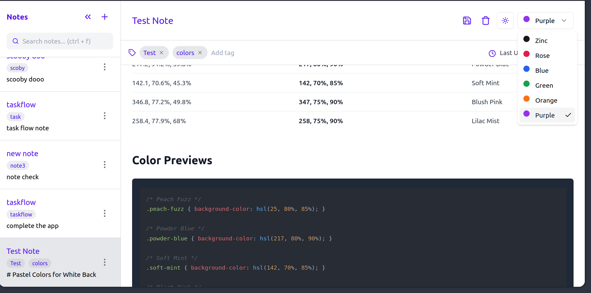
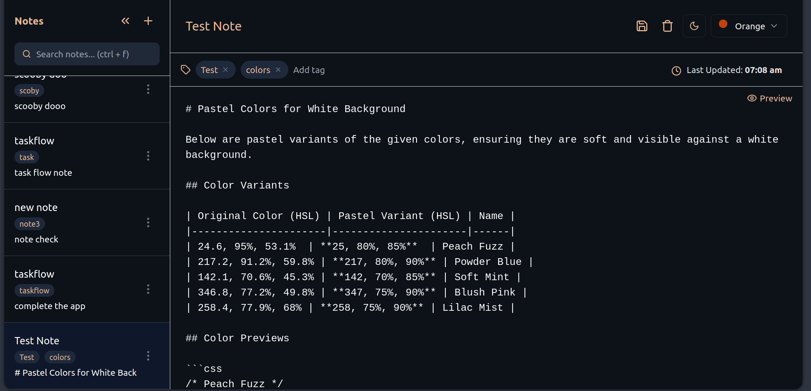
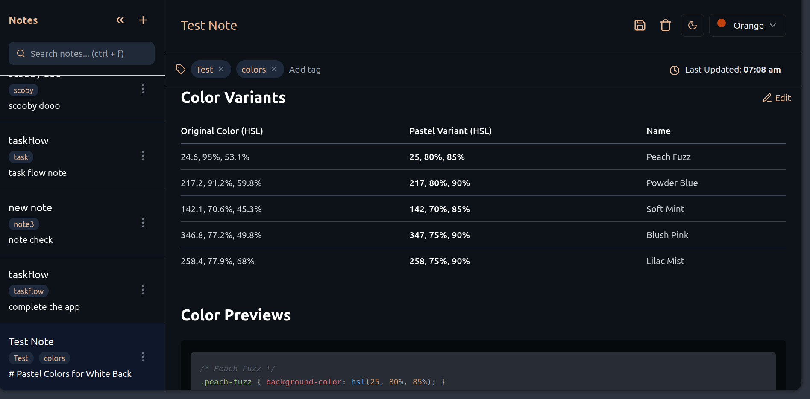

# NotesForge

A fast and lightweight task manager built with **Next.js** and **TypeScript**, designed for efficiency and simplicity with **SQLite** as its backend.

## 🚀 Features

- ⚡ **Fast & Scalable** – Built with Next.js for seamless performance.
- 🛠 **Typed & Maintainable** – Written in TypeScript for a better developer experience.
- 🗄 **Lightweight Database** – Uses SQLite, making it easy to set up and run locally.
- 🐳 **Docker Support** – Easily containerized and deployable.

---

## 📦 Getting Started

### 🔹 Prerequisites

Ensure you have **[Node.js](https://nodejs.org/)** (v16 or later) installed on your system:

---

## 🏃 Running Locally

### 1️⃣ Clone the Repository

```sh
git clone https://github.com/achyutem/notesforge.git
cd notesforge
npm install
npm run dev
```

Open [http://localhost:3000](http://localhost:3000) with your browser to see the result.

# 🐳 Docker Guide

## 📦 Prerequisites

Ensure you have **[Docker](https://docs.docker.com/get-docker/)** installed on your system:

---

### 1️⃣ Clone the Repository

```sh
git clone https://github.com/achyutem/notesforge.git
cd notesforge
```

---

## 🛠 Building the Docker Image

To create a fresh Docker image, run:

```sh
docker build --no-cache -t notesforge .
```

To run the docker image, run:

```
docker run -p 3000:3000 notesforge
```

## Previews




